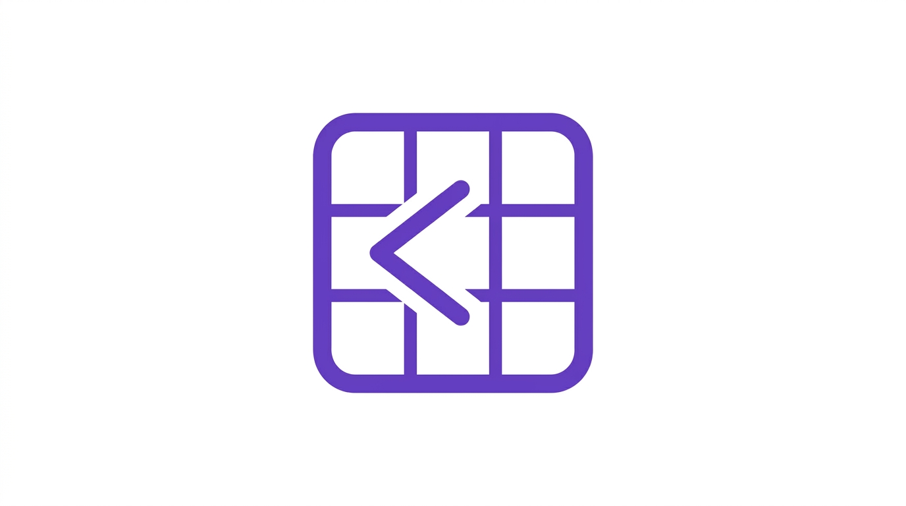
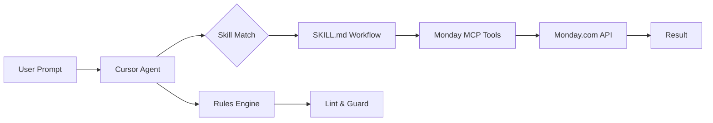

<p align="center">
  
</p>

<h1 align="center">Monday Developer Tools</h1>

<p align="center">
  <em>Monday.com project management for Cursor IDE -- boards, items, sprints, and the full GraphQL API.</em>
</p>

<!-- Row 1: Identity -->
<p align="center">
  <a href="https://github.com/TMHSDigital/Monday-Cursor-Plugin/releases"></a>
  <a href="https://github.com/TMHSDigital/Monday-Cursor-Plugin/releases"></a>
  <a href="LICENSE"></a>
  <a href="https://tmhsdigital.github.io/Monday-Cursor-Plugin/"></a>
</p>

<!-- Row 2: CI -->
<p align="center">
  <a href="https://github.com/TMHSDigital/Monday-Cursor-Plugin/actions/workflows/ci.yml"></a>
  <a href="https://github.com/TMHSDigital/Monday-Cursor-Plugin/actions/workflows/validate.yml"></a>
  <a href="https://github.com/TMHSDigital/Monday-Cursor-Plugin/actions/workflows/codeql.yml"></a>
</p>

<!-- Row 3: Community -->
<p align="center">
  <a href="https://github.com/TMHSDigital/Monday-Cursor-Plugin/stargazers"></a>
  <a href="https://github.com/TMHSDigital/Monday-Cursor-Plugin/issues"></a>
</p>

<!-- Row 4: Counts -->
<p align="center">
  <strong>21 skills</strong> &bull; <strong>8 rules</strong> &bull; <strong>~45 MCP tools</strong>
</p>

---

## Compatibility

| Environment | Status | Notes |
|---|---|---|
| **Cursor IDE** | Fully supported | Install from marketplace or symlink locally |
| **Claude Code** | Partial | Skills and rules work; MCP tools require manual config |
| **Other MCP Clients** | Partial | Monday MCP plugin works in any MCP-compatible client |

---

## Quick Start

Open Cursor and try these prompts:

```
Create a new board called "Q3 Sprint" with Status, Person, and Timeline columns
```

```
Show me a summary of all items in my "Product Roadmap" board grouped by status
```

```
Set up a sprint board for the next two-week iteration starting Monday
```

---

## How It Works



The plugin provides **skills** (step-by-step workflows) and **rules** (guardrails) that guide the Cursor agent. Skills call the official Monday.com MCP plugin, which handles authentication and GraphQL execution.

---

## Skills

<details>
<summary><strong>21 Skills -- full catalog</strong></summary>

### Core

| Skill | Description |
|---|---|
| `monday-board-management` | Create, configure, duplicate, archive, delete boards; columns, groups, permissions |
| `monday-item-operations` | Create, update, move, archive, delete items and subitems |
| `monday-workspace-organizer` | Workspaces, folders, board hierarchy |
| `monday-api-reference` | GraphQL schema, query building, pagination, complexity budgets |

### Views & Reporting

| Skill | Description |
|---|---|
| `monday-dashboard-builder` | Create dashboards, widgets, chart types, connect boards |
| `monday-board-insights` | Aggregate, filter, analyze board data for reporting |
| `monday-chart-visualization` | Render pie/bar charts, battery widgets from board data |

### Collaboration

| Skill | Description |
|---|---|
| `monday-updates-and-communication` | Post updates, replies, mentions; read update history |
| `monday-docs-management` | Create, read, append Monday Docs; version history |
| `monday-notifications` | Bell and email notifications |

### Dev & Sprints

| Skill | Description |
|---|---|
| `monday-sprint-planning` | Sprint boards, metadata, iteration planning |
| `monday-sprint-review` | Completed sprint analysis, velocity, burndown |
| `monday-notetaker-meetings` | Meeting notes, summaries, action items, transcripts |

### Automation

| Skill | Description |
|---|---|
| `monday-workflow-automation` | Automation recipes, triggers, conditions, actions |
| `monday-form-builder` | Forms, questions, conditional logic |
| `monday-webhook-management` | Webhook CRUD, challenge verification, JWT auth |

### Project Management

| Skill | Description |
|---|---|
| `monday-project-tracking` | Timeline, dependencies, critical path, status reporting |
| `monday-resource-management` | Team assignment, workload, capacity planning |

### Administration

| Skill | Description |
|---|---|
| `monday-user-and-team-management` | Users, teams, permissions, roles |
| `monday-column-types-guide` | Column type reference, value formats |
| `monday-tags-and-assets` | Tag management, file/asset operations |

</details>

---

## Rules

<details>
<summary><strong>8 Rules -- guardrails and best practices</strong></summary>

| Rule | What It Catches |
|---|---|
| **API Token Safety** | Flag hardcoded API tokens, OAuth secrets, webhook signing secrets |
| **GraphQL Best Practices** | Flag over-fetching, missing pagination, unbounded queries |
| **Rate Limit Awareness** | Flag missing retry/backoff, unbounded API loops, missing complexity budgets |
| **Column Value Format** | Flag malformed column value JSON for status, date, timeline, people columns |
| **Webhook Validation** | Flag missing challenge verification, unvalidated payloads, exposed URLs |
| **MCP Tool Preference** | Flag raw fetch/axios calls to api.monday.com when MCP tools are available |
| **Board Structure** | Flag too many columns, missing groups, inconsistent naming |
| **Error Handling** | Flag unchecked API responses, missing error parsing |

</details>

---

## Monday MCP Tools

This plugin leverages the **official Monday.com MCP plugin** (`plugin-monday.com-monday`). Install it from the [Cursor Marketplace](https://cursor.com/plugins) -- no custom MCP server required.

<details>
<summary><strong>~45 tools -- full catalog</strong></summary>

### Context & Search

| Tool | What It Does |
|---|---|
| `get_user_context` | Current user, favorites, relevant boards |
| `search` | Search boards, documents, folders |
| `list_users_and_teams` | Look up users and teams |

### Boards, Items & Updates

| Tool | What It Does |
|---|---|
| `get_board_info` | Board metadata, structure, owners, views |
| `get_board_items_page` | Paginated items with filters and search |
| `board_insights` | Aggregate and analyze board data |
| `create_board` | Create a new board |
| `create_group` | Add a group to a board |
| `create_column` | Add a column to a board |
| `create_item` | Create items, subitems, or duplicates |
| `change_item_column_values` | Update item column values |
| `get_updates` | Read updates on items or boards |
| `create_update` | Post updates with mentions |
| `get_board_activity` | Board activity log |

### Workspaces & Folders

| Tool | What It Does |
|---|---|
| `list_workspaces` | List/search workspaces |
| `workspace_info` | Boards, docs, folders in a workspace |
| `create_workspace` | Create a workspace |
| `update_workspace` | Update workspace attributes |
| `create_folder` | Create a folder |
| `update_folder` | Update folder attributes |
| `move_object` | Move boards/folders/overviews |

### Docs

| Tool | What It Does |
|---|---|
| `read_docs` | Read doc content or version history |
| `create_doc` | Create a doc in workspace or attached to item |
| `add_content_to_doc` | Append markdown to a doc |

### Dashboards & Widgets

| Tool | What It Does |
|---|---|
| `create_dashboard` | Create a dashboard |
| `create_widget` | Add a widget to dashboard or board view |
| `all_widgets_schema` | Widget type JSON schemas |

### Forms

| Tool | What It Does |
|---|---|
| `create_form` | Create a form with response board |
| `get_form` | Get form by token |
| `update_form` | Update form settings, appearance, questions |
| `form_questions_editor` | Create/update/delete individual questions |

### Sprints & Meetings

| Tool | What It Does |
|---|---|
| `get_monday_dev_sprints_boards` | Discover sprint/tasks board pairs |
| `get_sprints_metadata` | Sprint table from sprints board |
| `get_sprint_summary` | Completed sprint analysis |
| `get_notetaker_meetings` | Meeting notes and transcripts |

### API & Schema

| Tool | What It Does |
|---|---|
| `get_graphql_schema` | Schema overview (read vs write) |
| `get_type_details` | Details for a GraphQL type |
| `get_column_type_info` | Column type metadata |
| `all_monday_api` | Run arbitrary GraphQL (escape hatch) |

### UI Components

| Tool | What It Does |
|---|---|
| `show-chart` | Render pie/bar charts |
| `show-battery` | Render battery/progress indicators |
| `show-table` | Render interactive board tables |
| `show-assign` | Render assignment UI |

### Notifications

| Tool | What It Does |
|---|---|
| `create_notification` | Send bell/email notifications |

</details>

---

## Installation

### Prerequisites

- [Cursor IDE](https://cursor.com/) installed
- Monday.com MCP plugin installed from the Cursor Marketplace

### Option 1: Cursor Marketplace

Search for **Monday Developer Tools** in the Cursor plugin marketplace and install.

### Option 2: Local Symlink

Clone this repo, then symlink into your Cursor plugins directory:

**Windows (PowerShell -- run as Administrator):**

```powershell
New-Item -ItemType SymbolicLink `
  -Path "$env:USERPROFILE\.cursor\plugins\monday-developer-tools" `
  -Target "C:\path\to\Monday-Cursor-Plugin"
```

**macOS / Linux:**

```bash
ln -s /path/to/Monday-Cursor-Plugin \
  ~/.cursor/plugins/monday-developer-tools
```

Restart Cursor after symlinking.

---

## Usage Examples

<details>
<summary><strong>One prompt per skill</strong></summary>

| Skill | Example Prompt |
|---|---|
| `monday-board-management` | "Create a board called 'Engineering Tasks' with Status, Person, Priority, and Due Date columns" |
| `monday-item-operations` | "Add three items to the 'To Do' group: Set up CI, Write tests, Deploy staging" |
| `monday-workspace-organizer` | "Create a workspace called 'Product Team' and move boards 'Roadmap' and 'Bugs' into it" |
| `monday-api-reference` | "Show me the GraphQL query to fetch all items with their column values from board 123456" |
| `monday-dashboard-builder` | "Create a dashboard called 'Sprint Overview' with a status breakdown chart from my sprint board" |
| `monday-board-insights` | "How many items are stuck in 'In Review' for more than 5 days on my tasks board?" |
| `monday-chart-visualization` | "Show a pie chart of item status distribution for board 'Product Roadmap'" |
| `monday-updates-and-communication` | "Post an update on item 789 mentioning @sarah: 'Design review complete, ready for dev'" |
| `monday-docs-management` | "Create a Monday Doc called 'Sprint 12 Retro' with sections for Wins, Improvements, and Actions" |
| `monday-notifications` | "Send a notification to the 'Engineering' team about the deployment freeze" |
| `monday-sprint-planning` | "Set up a two-week sprint starting next Monday with items from the backlog board" |
| `monday-sprint-review` | "Generate a sprint review for the last completed sprint -- velocity, completed items, carryover" |
| `monday-notetaker-meetings` | "Summarize action items from today's standup meeting" |
| `monday-workflow-automation` | "Create an automation: when Status changes to Done, move item to the 'Completed' group" |
| `monday-form-builder` | "Build a bug report form with fields for severity, steps to reproduce, and expected behavior" |
| `monday-webhook-management` | "Set up a webhook that fires when items are created on my 'Intake' board" |
| `monday-project-tracking` | "Show the critical path and any blocked items on the 'Q3 Launch' project board" |
| `monday-resource-management` | "Show team workload for next week -- who's overallocated?" |
| `monday-user-and-team-management` | "List all users in the 'Design' team and their roles" |
| `monday-column-types-guide` | "What's the correct JSON format to set a Timeline column value?" |
| `monday-tags-and-assets` | "Tag all items in the 'Bugs' group with 'critical' and 'frontend'" |

</details>

---

## Configuration

### Monday API Token

The Monday.com MCP plugin handles authentication. When you first use a Monday MCP tool, the plugin will prompt you to authenticate via the Monday.com OAuth flow.

Alternatively, set your API token in Cursor settings:

1. Go to **Monday.com** > **Admin** > **API**
2. Copy your personal API token
3. Configure it in the Monday MCP plugin settings

### What Works Without Auth

- Reading skill documentation and workflows
- Rule-based linting and code review
- GraphQL query building guidance
- Column value format reference

All MCP tool calls (creating boards, reading items, posting updates, etc.) require authentication.

---

## Roadmap

<details>
<summary><strong>Release plan</strong></summary>

| Version | Milestone | Status |
|---|---|---|
| **v0.1.0** | Foundation -- 6 core skills, 3 rules, plugin scaffold, tests, CI | Done |
| **v0.2.0** | Views -- dashboard builder, board insights, chart visualization + column format rule | Planned |
| **v0.3.0** | Collaboration -- updates, docs, notifications + webhook validation rule | Planned |
| **v0.4.0** | Sprints -- planning, review, notetaker + error handling rule | Planned |
| **v0.5.0** | Automation -- workflows, forms, webhooks + MCP tool preference rule | Planned |
| **v0.6.0** | PM -- project tracking, resources, tags/assets + board structure rule | Planned |
| **v1.0.0** | Stable -- all 21 skills, 8 rules, full test coverage | Planned |

</details>

---

## Contributing

See [CONTRIBUTING.md](CONTRIBUTING.md) for guidelines on adding skills, rules, and tests.

---

## Support

If this plugin saves you time, consider [sponsoring the project](https://github.com/sponsors/TMHSDigital).

Found a bug? [Open an issue](https://github.com/TMHSDigital/Monday-Cursor-Plugin/issues/new).

---

## License

This project is licensed under the [Creative Commons Attribution-NonCommercial-NoDerivatives 4.0 International License](https://creativecommons.org/licenses/by-nc-nd/4.0/).

See [LICENSE](LICENSE) for the full text.

---

## API References

<details>
<summary><strong>Monday.com developer resources</strong></summary>

- [Monday API Documentation](https://developer.monday.com/api-reference/reference)
- [GraphQL API Playground](https://developer.monday.com/api-reference/docs/introduction)
- [Monday Apps Framework](https://developer.monday.com/apps/docs/intro)
- [API Versioning](https://developer.monday.com/api-reference/docs/api-versioning)
- [Rate Limits & Complexity](https://developer.monday.com/api-reference/docs/rate-limits)
- [Column Types Reference](https://developer.monday.com/api-reference/docs/column-types-reference)
- [Webhooks Guide](https://developer.monday.com/api-reference/docs/webhooks)
- [Monday MCP Plugin](https://cursor.com/plugins) (Cursor Marketplace)

</details>

---

<p align="center">
  Built by <a href="https://github.com/TMHSDigital">TMHSDigital</a>
</p>
